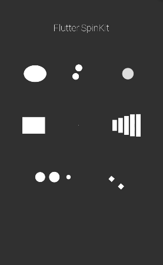

# ✨ Flutter Spinkit

A collection of loading indicators animated with flutter. Heavily inspired by [@tobiasahlin](https://github.com/tobiasahlin)'s [SpinKit](https://github.com/tobiasahlin/SpinKit).

## 🎖 Installing

```yaml
dependencies:
  flutter_spinkit:
      git:
        url: git://github.com/jogboms/flutter_spinkit
```

### ⚡️ Import

```dart
import 'package:flutter_spinkit/flutter_spinkit.dart';
```

## 🎮 How To Use

More info soon, but, so far.

```dart
final width = 50.0;
final height = 50.0;
final color = Colors.white;

// SpinKitChasingDots
// SpinKitDoubleBounce
// SpinKitRotatingPlain
// SpinKitPulse
// SpinKitWave
// SpinKitCircle
// SpinKitThreeBounce
// SpinKitWanderingCubes

SizedBox(
  height: 64.0,
  child: SpinKitRotatingCircle(
    color: color,
    width: width,
    height: height,
  ),
);
```

## 🚀 Roadmap

<table>
  <tr>
    <td align="center">
      
      <br />
      RotatingPlane
      <br />
      ✅
    </td>
    <td align="center">
      
      <br />
      DoubleBounce
      <br />
      ✅
    </td>
    <td align="center">
      
      <br />
      Wave
      <br />
      ✅
    </td>
    <td align="center">
      
      <br />
      WanderingCubes
      <br />
      ✅
    </td>
  </tr>
  <tr>
    <td align="center">
      
      <br />
      Pulse
      <br />
      ✅
    </td>
    <td align="center">
      
      <br />
      ChasingDots
      <br />
      ✅
    </td>
    <td align="center">
      
      <br />
      ThreeBounce
      <br />
      ✅
    </td>
    <td align="center">
      
      <br />
      Circle
      <br />
      <i>⏳</i>
    </td>
  </tr>
  <tr>
    <td align="center">
      
      <br />
      CubeGrid
      <br />
      <i>⏳</i>
    </td>
    <td align="center">
      
      <br />
      FadingCircle
      <br />
      ✅
    </td>
    <td align="center">
      
      <br />
      FoldingCube
      <br />
      <i>⏳</i>
    </td>
    <td align="center">
      
      <br />
      RotatingCircle
      <br />
      ✅
    </td>
  </tr>
</table>

> GIF images gotten from [Android Spinkit](https://github.com/ybq/Android-SpinKit).

## 🔥 Flutter Story So far...



## 🐛 Bugs/Requests

If you encounter any problems feel free to open an issue. If you feel the library is
missing a feature, please raise a ticket on Github and I'll look into it.
Pull request are also welcome.

### ❗️ Note

For help getting started with Flutter, view our online
[documentation](https://flutter.io/).

For help on editing plugin code, view the [documentation](https://flutter.io/platform-plugins/#edit-code).

> Still unstable for now. Roadmap still has some unchecked items and a bit of clean up still very much neccessary. By the way, any helping hand whatsoever is still appreciated as well. 😊

## ⭐️ License

MIT License
